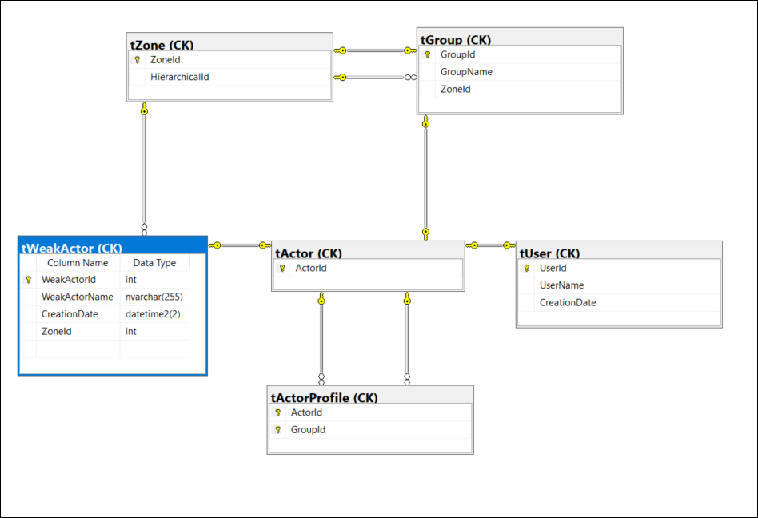

# CK-DB-Actor-WeakActor

A WeakActor is not a user.

A WeakActor is a kind of Actor that has a low complexity, aimed to be used as an auto login to perform simple tasks associated with a name.
Considering this, a WeakActor is defined by its unique WeakActorName.

## Actor.WeakActor

Extend [CK-DB-Actor](https://github.com/Invenietis/CK-DB/tree/develop/CK.DB.Actor) that is a minimal model that handles Users and Groups.

Create a weak actor with a **unique name**.

You can identify any weak actor with an **id**, and monitor it with its unique **name**.

A weak actor can be added to a **Group** as any actor, with its [specific stored procedure](CK.DB.Actor.WeakActor/Res/sGroupWeakActorAdd.sql).

The only view, `CK.vWeakActor` is mirroring all fields from the table `CK.tWeakActor`. It is going to be transformed by other packages.

## Zone.WeakActor

Adds the support of [Zones](https://github.com/Invenietis/CK-DB/tree/develop/CK.DB.Zone) that are Groups and contains a set of Groups. Zones implement a
one-level only group hierarchies.

Create a weak actor within a **unique zone**.

You can identity any weak actor with an id, and monitor it with its unique couple of **Name/Zone**.

The view `CK.vWeakActor` being [transformed](./CK.DB.Zone.WeakActor/Res/vWeakActor.tql), exposes DisplayName that is a unique composition of WeakActorName and its ZoneId as `WeakActorName(#-ZoneId)`

## HZone.WeakActor

With [CK.DB.HZone](https://github.com/Invenietis/CK-DB/tree/develop/CK.DB.HZone), extends the [CK.DB.Zone](https://github.com/Invenietis/CK-DB/tree/develop/CK.DB.Zone) to be hierarchical. Thanks to this package, Zones (that are Groups) can be
subordinated to a parent Zone.

A WeakActor is **unique within a Zone** and can be added to any group in the whole **Hierarchy**.

## Zone.WeakActor.SimpleNaming

Extend the CK.DB.Zone.SimpleNaming Package. The only change is the view CK.vWeakActor **DisplayName** that get a name like `WeakActorName(ZoneGroupName)` instead of `WeakActorName(#-ZoneId)`

The view `CK.vWeakActor` being [transformed](./CK.DB.Zone.WeakActor.SimpleNaming/Res/vWeakActor.tql), exposes DisplayName that is a
unique composition of WeakActorName and its Zone GroupName as `WeakActorName(ZoneGroupName)`.

## Usage

It is important to be aware of the fact that a WeakActor is unique in a Zone. When dealing with Hierarchical Zones, it can be more tricky. The unique constraint (ZoneId + WeakActorName) is kind of obsolete but has to be honored in a special way.
You can use [CK.fIsWeakActorNameInHierarchy](CK.DB.HZone.WeakActor/Res/fIsWeakActorNameInHierarchy.sql) to check name availability.

In general, the architecture of the WeakActor is constrained by the stored procedures.

If there is any process that seems complicated or weak, feel free to contact me or open an issue.

### Nice Hack

When you want to change the ZoneId of a WeakActor, you must use [CK.sWeakActorZoneMove](CK.DB.Zone.WeakActor/Res/sWeakActorZoneMove.sql), extended in HZone.

Moving a WeakActor probably does not make sense if you don't change its WeakActorName. If you have to move a lot of WeakActor, consider passing the optional parameter `NewWeakActorName` with the best matching unique name already available:
See [CK.vWeakActor](CK.DB.Actor.WeakActor/Res/vWeakActor.sql) on the column DisplayName. DisplayName is always unique in the Database. This way, using the DisplayName as the new name ensure that this name is valid. On the other hand, it helps any user managing those actor to see from where they come from.

Example with SimpleNaming:

| Name    | GroupName(Zone) | DisplayName        | New GroupName(Zone) | New Name           | New DisplayName              |
|---------|-----------------|--------------------|---------------------|--------------------|------------------------------|
| Aymeric | Mercoeur        | Aymeric (Mercoeur) | Burnouf             | Aymeric (Mercoeur) | Aymeric (Mercoeur) (Burnouf) |

## Database Diagram

This is the diagram of **Zone.WeakActor.SimpleNaming** (so all packages).

## TODO

- Add a WeakActor to a group from GroupTable (the method is available through WeakActorTable, that may be not intuitive)
- sGroupUserRemove and even more sZoneUserRemove has to be watched out.
- sWeakActorRename
- Be aware and careful of a global issue: From Actor package, users (tUser) consider being alone in the system. A lot of ambiguity around Actor / User.
- The constraint [UK_CK_tWeakActor_WeakActorName_ZoneId]( CK.DB.Zone.WeakActor/Res/Model/CK.WeakActorTable-Zone.Install.1.0.0.sql) is not enough in HZone. The WeakActorName is unique in the whole Hierarchy.
