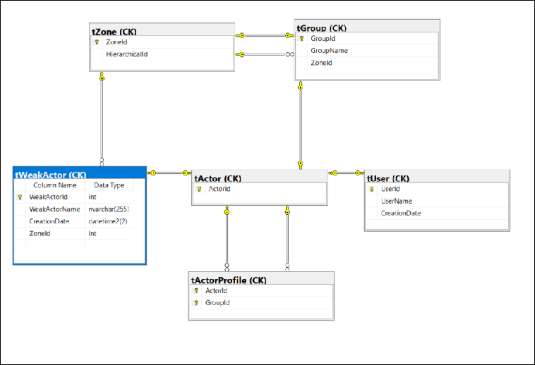

# CK-DB-WeakActor

| CK.DB                       | Nuget                                                                                                                                                  |
|-----------------------------|--------------------------------------------------------------------------------------------------------------------------------------------------------|
| Actor.WeakActor             |                          |
| Zone.WeakActor              |                            |
| Zone.WeakActor.SimpleNaming |  |
| HZone.WeakActor             |                          |

A WeakActor is not a user.

A WeakActor is a kind of Actor that has a low complexity, aimed to be used as an auto login to perform simple tasks associated with a name.
Its WeakActorName identifies it: how unique this name must be depends on the installed packages (see below).

## Actor.WeakActor

Extend [CK-DB-Actor](https://github.com/signature-opensource/CK-DB/tree/stable/CK.DB.Actor) that is a minimal model that handles Users and Groups.

Create a weak actor with a **unique name**.

You can identify any weak actor with an **id**, and monitor it with its unique **name**.

A weak actor can be added to a **Group** as any actor, with the standard `GroupTable.AddMember` (`CK.sGroupMemberAdd`).

The only view, `CK.vWeakActor` is mirroring all fields from the table `CK.tWeakActor`. It is going to be transformed by other packages.

See the [package README](./CK.DB.Actor.WeakActor/README.md).

## Zone.WeakActor

Adds the support of [Zones](https://github.com/signature-opensource/CK-DB/tree/stable/CK.DB.Zone) that are Groups and contains a set of Groups. Zones implement a
one-level only group hierarchies.

Create a weak actor within a **unique zone** (its defining Zone): the WeakActorName is unique in its defining Zone
(constraint `UK_CK_tWeakActor_WeakActorName_ZoneId`) and the weak actor can only appear in the Groups of this Zone.
When a Group is moved to another Zone, its weak actors don't follow it.

You can identity any weak actor with an id, and monitor it with its unique couple of **Name/Zone**.

The view `CK.vWeakActor` being [transformed](./CK.DB.Zone.WeakActor/Res/vWeakActor.tql), exposes DisplayName that is a unique composition of WeakActorName and its ZoneId as `WeakActorName (#Zone-ZoneId)`.

See the [package README](./CK.DB.Zone.WeakActor/README.md).

## HZone.WeakActor

With [CK.DB.HZone](https://github.com/signature-opensource/CK-DB/tree/stable/CK.DB.HZone), extends the [CK.DB.Zone](https://github.com/signature-opensource/CK-DB/tree/stable/CK.DB.Zone) to be hierarchical. Thanks to this package, Zones (that are Groups) can be
subordinated to a parent Zone.

A WeakActor is **unique along a hierarchy branch** (no weak actor with the same name in a parent or a child Zone, sibling branches can reuse it)
and can be added to the Groups of its defining Zone **and of its child Zones**. Moving a Group or a Zone keeps these invariants.

See the [package README](./CK.DB.HZone.WeakActor/README.md).

## Zone.WeakActor.SimpleNaming

Extend the CK.DB.Zone.SimpleNaming Package. The only change is the view CK.vWeakActor **DisplayName** that get a name like `WeakActorName (ZoneGroupName)` instead of `WeakActorName (#Zone-ZoneId)`

The view `CK.vWeakActor` being [transformed](./CK.DB.Zone.WeakActor.SimpleNaming/Res/vWeakActor.tql), exposes DisplayName that is a
composition of WeakActorName and its Zone GroupName as `WeakActorName (ZoneGroupName)`.

Note that with CK.DB.Zone.SimpleNaming, a GroupName (and therefore a Zone name) is only unique among the Groups of the same Zone:
with HZone, two Zones with the same name in different parent Zones can define a weak actor with the same name, and the DisplayName
is then not unique.

## Usage

It is important to be aware of the fact that a WeakActor is unique in a Zone. When dealing with Hierarchical Zones, this is stronger:
the unique constraint (ZoneId + WeakActorName) is still there, but the stored procedures also ensure the uniqueness along a hierarchy branch
(`CK.sWeakActorCreate` and the Zone move throw `WeakActor.WeakActorNameShouldBeUniqueInHZone`).

In general, the architecture of the WeakActor is constrained by the stored procedures.

If there is any process that seems complicated or weak, feel free to contact me or open an issue.

The defining Zone of a WeakActor cannot be changed.

## Database Diagram

This is the diagram of **Zone.WeakActor.SimpleNaming** (so all packages).

## TODO

- `CK.sWeakActorRename` checks the name globally (`WeakActor.NameAlreadyTaken` if the name exists in any Zone): it is not transformed
  by Zone.WeakActor (unique in the defining Zone) nor by HZone.WeakActor (unique along a hierarchy branch).
- Be aware and careful of a global issue: From Actor package, users (tUser) consider being alone in the system. A lot of ambiguity around Actor / User.
